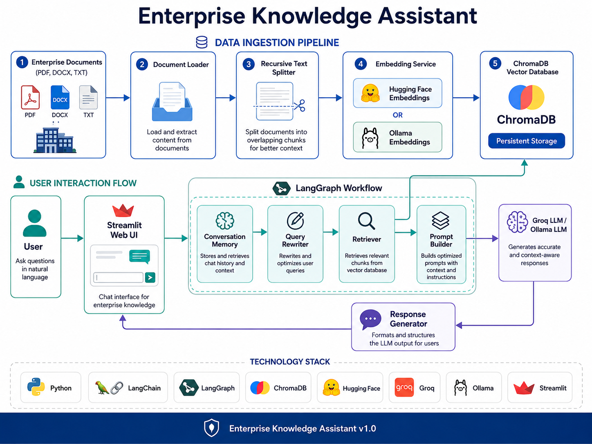
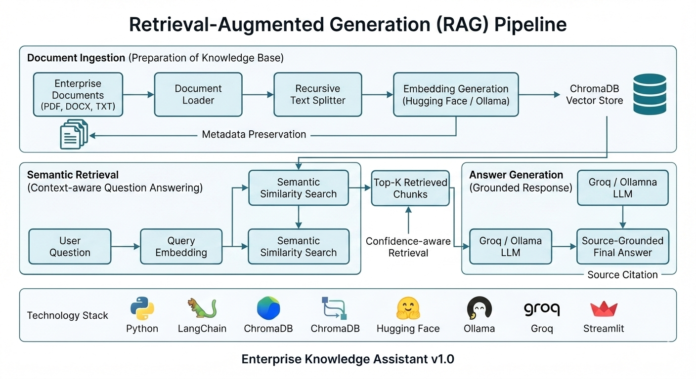
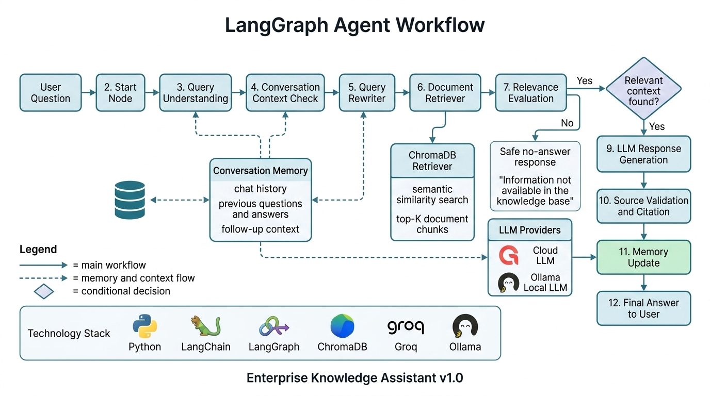
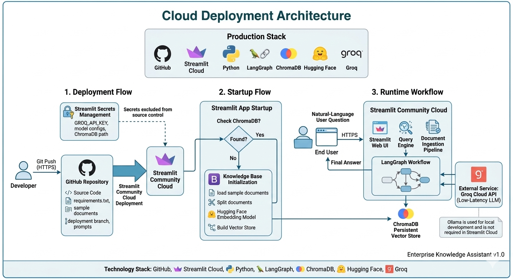
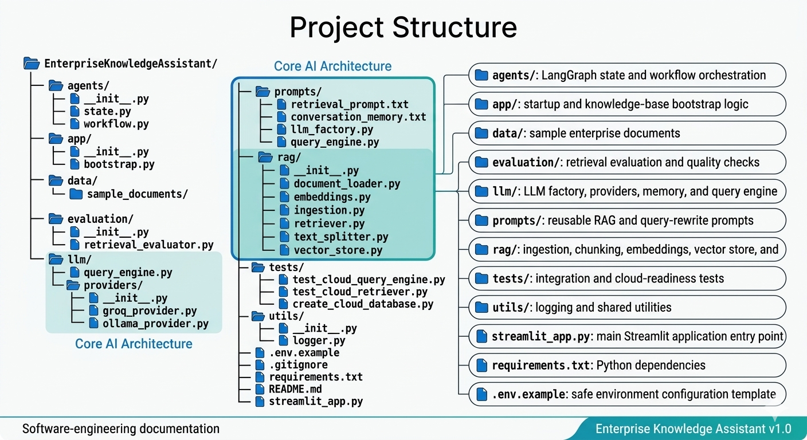
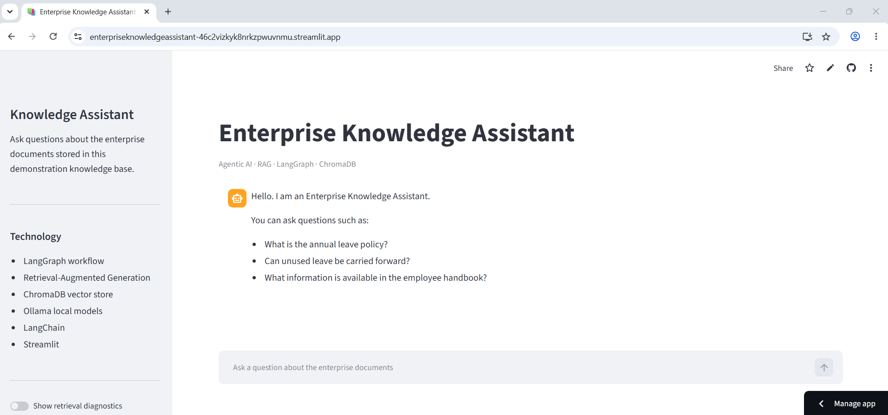
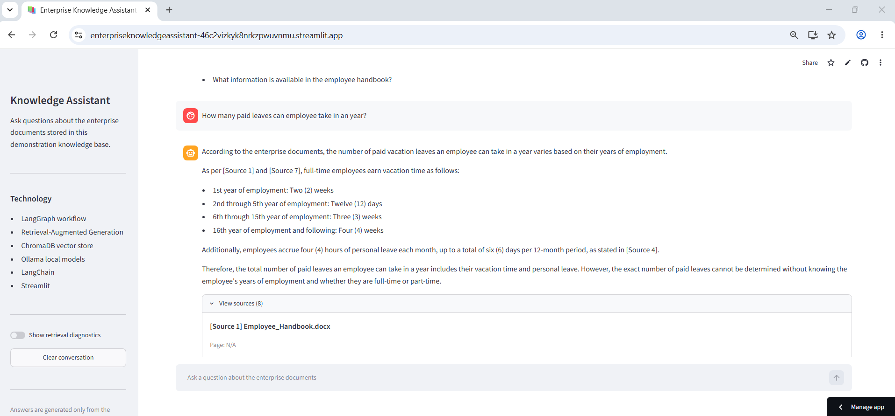
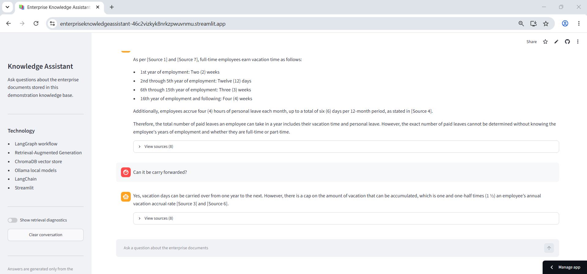
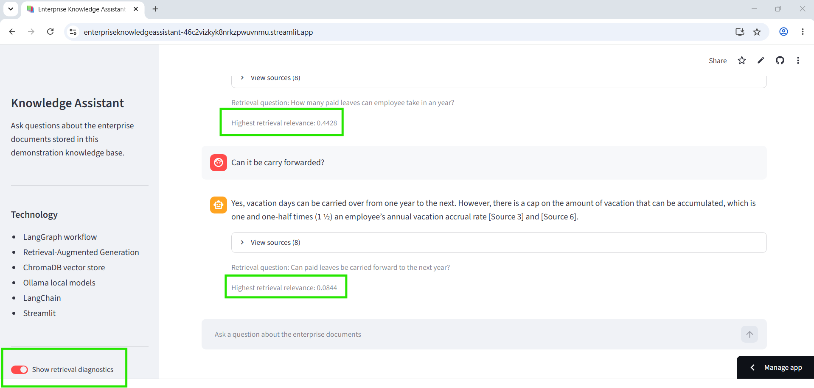
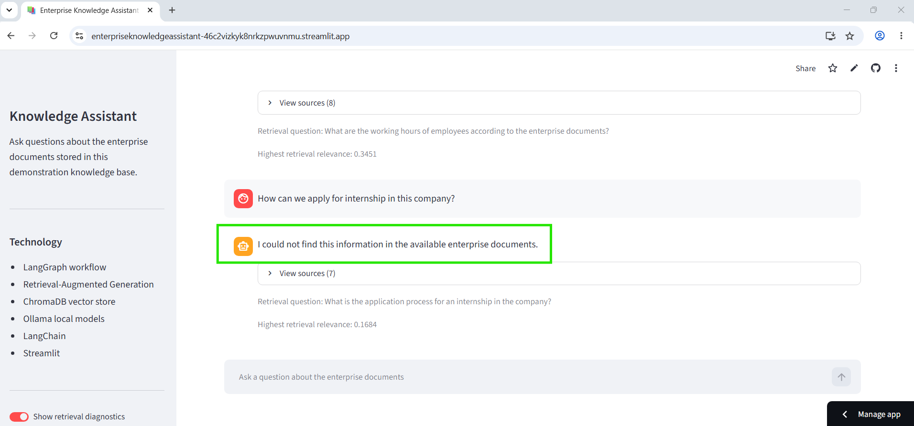

# 🧠 Enterprise Knowledge Assistant

### Agentic AI-powered Enterprise Retrieval-Augmented Generation (RAG) Platform

[]()
[]()
[]()
[]()
[]()
[]()
[]()

---

## 🚀 Live Demo

**Application:** https://enterpriseknowledgeassistant-46c2vizkyk8nrkzpwuvnmu.streamlit.app/

## 💻 GitHub Repository

https://github.com/nagendra-official-ai/EnterpriseKnowledgeAssistant

---

## 📖 Overview

Enterprise Knowledge Assistant is a production-style AI application that enables users to interact with enterprise documents using natural language.

The application combines Retrieval-Augmented Generation (RAG), semantic search, LangGraph-based agent workflows, conversational memory, and Large Language Models to provide accurate, source-grounded responses from enterprise knowledge bases.

Unlike traditional chatbots, the assistant retrieves relevant information from enterprise documents before generating responses, helping reduce hallucinations and improving answer reliability.

## ✨ Key Features

- 📄 Enterprise document ingestion (PDF, DOCX, TXT)
- ✂️ Intelligent recursive text chunking
- 🔍 Semantic document retrieval using ChromaDB
- 🧠 Retrieval-Augmented Generation (RAG)
- 🤖 LangGraph-powered conversational workflow
- 💬 Multi-turn conversation memory
- 🔄 Follow-up question rewriting
- 📚 Source-grounded responses with citations
- 🌐 Provider-independent LLM architecture (Groq & Ollama)
- 🔗 Pluggable embedding providers (Hugging Face & Ollama)
- 📈 Retrieval confidence scoring
- 💻 Interactive Streamlit web application
- ☁️ Cloud deployment ready
- 📝 Modular and extensible enterprise architecture

## 🎯 Why this project?

Enterprise organizations store valuable knowledge across <b>HR policies, employee handbooks, operational procedures, and technical documentation</b>. Traditional keyword-based search often fails to provide contextual answers.

This project demonstrates how Agentic AI and Retrieval-Augmented Generation (RAG) can transform enterprise document search into an intelligent conversational experience by combining semantic retrieval, conversational memory, and large language models.

The architecture is designed to be modular, scalable, and cloud-ready, making it suitable as a foundation for enterprise knowledge management solutions.

# 🏗️ System Architecture

<p align="center">

</p>

The Enterprise Knowledge Assistant follows a modular architecture designed for extensibility and cloud deployment. Enterprise documents are processed through document loaders, recursively chunked, converted into vector embeddings, and stored in ChromaDB. User queries pass through LangGraph orchestration, semantic retrieval, conversational memory, and Large Language Models before source-grounded responses are returned.

# 🔍 Retrieval-Augmented Generation (RAG) Pipeline

<p align="center">

</p>

The ingestion pipeline transforms enterprise documents into searchable vector embeddings. During query time, semantic similarity search retrieves the most relevant document chunks, which are combined with the user question before generating a grounded response.

# 🤖 LangGraph Workflow

<p align="center">

</p>

The workflow orchestrates multiple AI components including:

- Query Understanding
- Follow-up Question Rewriting
- Semantic Retrieval
- Response Generation
- Conversation Memory Update
- Source Citation

# ☁️ Cloud Deployment

<p align="center">

</p>

The application is deployed using Streamlit Community Cloud with secure secret management. Hugging Face embeddings generate semantic vectors while Groq provides low-latency LLM inference. ChromaDB is automatically initialized during first deployment.

# 📁 Project Structure

<p align="center">

</p>

```
EnterpriseKnowledgeAssistant/
│
├── agents/
├── app/
├── data/
├── evaluation/
├── llm/
├── prompts/
├── rag/
├── tests/
├── utils/
├── streamlit_app.py
├── requirements.txt
└── README.md
```

# 🛠️ Technology Stack

| Category | Technologies |
|-----------|--------------|
| Programming Language | Python |
| AI Framework | LangChain |
| Agent Workflow | LangGraph |
| LLM Providers | Groq, Ollama |
| Embeddings | Hugging Face, Ollama |
| Vector Database | ChromaDB |
| UI Framework | Streamlit |
| Document Processing | PyPDF, DOCX2TXT |
| Version Control | Git, GitHub |

# ⚙️ Installation

```bash
git clone https://github.com/nagendra-official-ai/EnterpriseKnowledgeAssistant.git

cd EnterpriseKnowledgeAssistant

python -m venv venv

pip install -r requirements.txt

streamlit run streamlit_app.py
```

# 💬 Sample Questions

- What information is available in the employee handbook?

- What is the annual leave policy?

- Summarize the HR policy.

- Can employees work remotely?

- What are the travel reimbursement guidelines?

- Explain the onboarding process.

# 🎯 Skills Demonstrated

- Agentic AI
- Retrieval-Augmented Generation (RAG)
- LangChain
- LangGraph
- Semantic Search
- Vector Databases
- ChromaDB
- Hugging Face Embeddings
- Prompt Engineering
- Conversation Memory
- Source-grounded Generation
- Cloud Deployment
- Python
- Streamlit

# 🚀 Future Enhancements

- Authentication & Role-Based Access Control
- SharePoint Integration
- Confluence Integration
- OneDrive Integration
- Multi-Agent Collaboration
- Hybrid Retrieval (Keyword + Semantic)
- User Feedback & Evaluation
- Docker & Kubernetes Deployment
- LangSmith Observability
- CI/CD Pipeline

## 📸 Application Screenshots

The screenshots below demonstrate the key capabilities of the Enterprise Knowledge Assistant, including document-based question answering, source-grounded responses, conversation memory, and retrieval diagnostics.

### 1. Enterprise Knowledge Assistant Home

<p align="center">
  
</p>

The home page provides a simple conversational interface where users can ask natural-language questions about the enterprise documents available in the knowledge base.

---

### 2. Source-Grounded Answer Generation

<p align="center">
  
</p>

The assistant retrieves relevant document chunks from ChromaDB and uses them as context for answer generation. The response includes source details so users can identify which documents contributed to the final answer.

---

### 3. Multi-turn Conversation Memory

<p align="center">
  
</p>

The application maintains conversation history and rewrites follow-up questions into standalone queries. This allows users to ask contextual questions without repeating information from previous messages.

**Example conversation:**

```text
User: What is the annual leave policy?

User: Can it be carried forward to the next year?
```

The second question is interpreted using the context of the first question before document retrieval is performed.

---

### 4. Retrieval Sources and Diagnostics

<p align="center">
  
</p>

The diagnostics view displays information about the retrieval process, including relevant document chunks, metadata, and similarity results. This improves transparency and helps evaluate retrieval quality.

---

### 5. Safe No-answer Handling

<p align="center">
  
</p>

When the retrieved documents do not contain sufficient relevant information, the assistant returns a safe no-answer response instead of generating unsupported content.

This behavior helps reduce hallucinations and ensures that responses remain grounded in the enterprise knowledge base.


# 👨‍💻 Author

**Nagendra Mangali**

Senior AI Engineer | .NET Developer | Generative AI Enthusiast

GitHub:
https://github.com/nagendra-official-ai

LinkedIn:
https://www.linkedin.com/in/nagendra-mangali-953676272/

Live Demo:
https://enterpriseknowledgeassistant-46c2vizkyk8nrkzpwuvnmu.streamlit.app/

## License

This project is licensed under the MIT License.